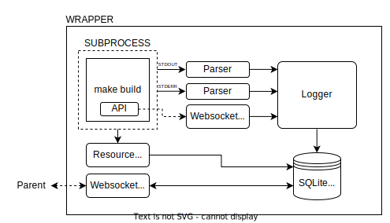

Gator is designed to aggregate the results from a lot of different jobs in a
scaleable manner, it does this by distributing the effort of launching and
monitoring to wrappers which then report back to parent tiers.

The diagram below shows how [!Jobs](specs/job.md) are allocated wrappers that
report back to parent tiers which handle [!JobGroups](specs/job_group.md) and
[!JobArrays](specs/job_array.md).

    { width="50%" }

## Wrappers

Each [!Job](specs/job.md) is run under a dedicated wrapper process. This process
is responsible for:

 * Launching the job within the allocated compute slot;
 * Monitoring STDOUT and STDERR and converting them into messages;
 * Storing log messages either recorded directly via the API or produced by
   parsing the STDOUT/STDERR streams;
 * Monitoring CPU and RAM usage at regular intervals;
 * Storing numerical metrics recorded via the API;
 * Determining the success or failure status of the job (no error messages and
   a zero exit code);
 * Reporting metrics, results, and other information back to the parent tier
   at regular intervals and when the job completes.

The wrapper contains a number of components to support these features:

 * Text parsers capture the STDOUT and STDERR streams and record log entries at
   info and error severity respectively;
 * A websocket server allows the process to communicate directly with the wrapper
   to log messages at specific severities or record arbitrary numerical metrics;
 * A logger object aggregates log entries emitted by the log parsers and through
   the API and redirects these to the log file, database, parent tier, or the
   screen as appropriate (it will usually do more than one of these);
 * An SQLite database records all of the log messages, metrics, resource usage
   statistics, and other attributes related to the job as it executes;
 * A websocket client connects to the parent tier to deliver heartbeat status
   updates and to receive queries from higher up the job tree.

{ width="100%" }

## Tiers

[!JobGroups](specs/job_group.md) and [!JobArrays](specs/job_array.md) are handled
by dedicated tier processes. Each tier is responsible for:

 * Launching wrappers to handle [!Jobs](specs/job.md) or further tiers to handle
   nested [!JobGroups](specs/job_group.md) or [!JobArrays](specs/job_array.md);
 * Providing the work specification to each wrapper or tier as it launches;
 * Collecting heartbeat status updates from child wrappers and tiers;
 * Managing dependencies between jobs, groups, or arrays and launching or
   discarding further stages only when all dependencies have been resolved;
 * Aggregating and reporting metrics, results, and other information back to the
   parent tier at regular intervals and when all children have completed.

Each tier is contains an instance of a [scheduler](./schedulers.md), which manages
the process of launching wrappers or nested tiers on the compute infrastructure
and providing the URL of the parent tier to the child.

The tier contains a number of components to support these features:

 * A websocket client attaches to the parent tier to fetch the work specification
   and to send back aggregated status reports;
 * A websocket client attaches to immediate child wrappers and tiers to provide
   corresponding sections of the work specification and to receive status updates
   from these lower layers;
 * An orchestrator coordinates launching wrappers and nested tiers when any
   job dependencies are satisfied;
 * A scheduler abstracts the complexities of launching wrappers and nested tiers
   on the compute infrastructure.

{ width="100%" }

!!! info

    The root tier must be provided its work specification directly - either via
    reading a YAML file from the disk, or by being called as a library from
    another tool. All other tiers and wrappers in the hierarchy will then
    receive their section of the work specification via the websocket connection
    to their parent tier.
